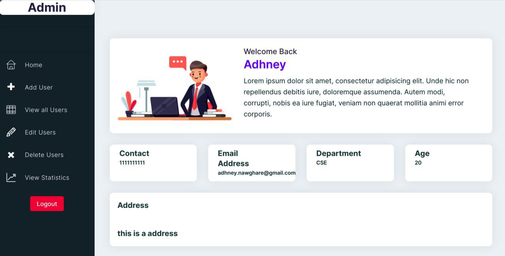
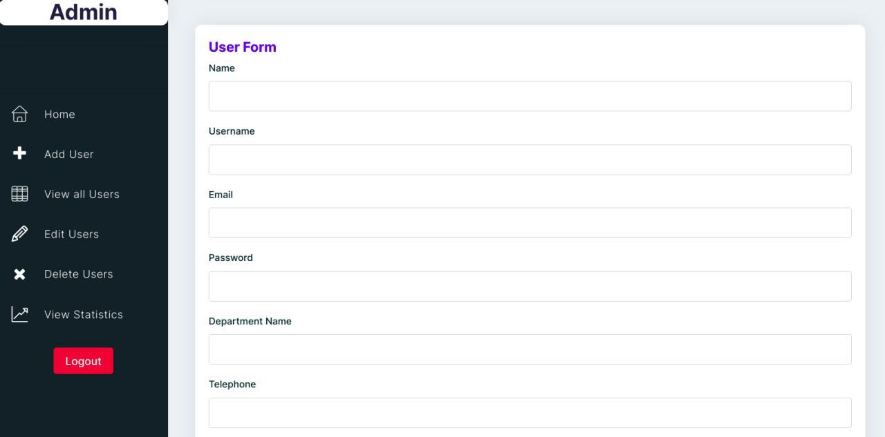
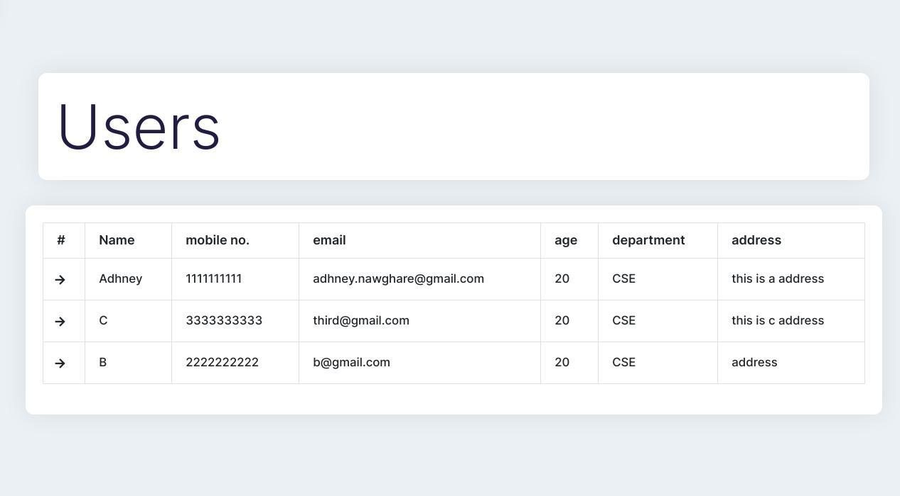
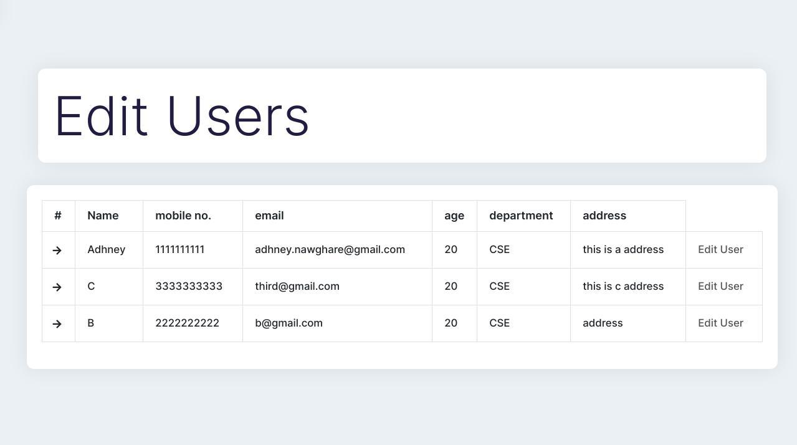
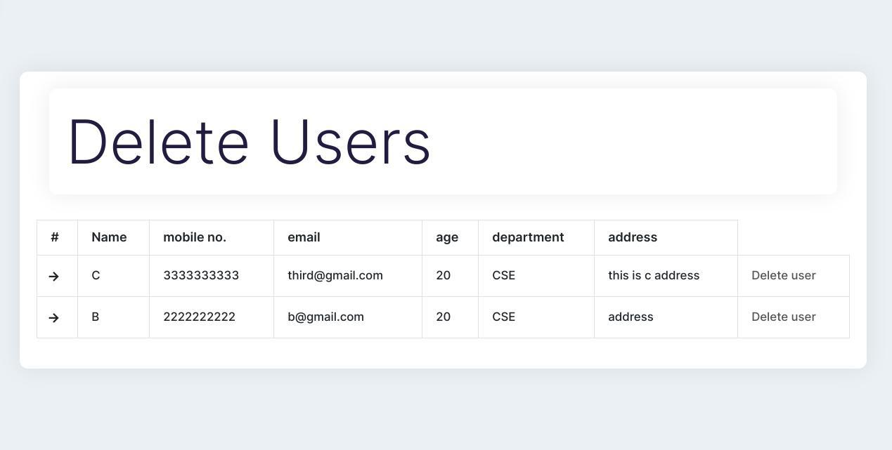
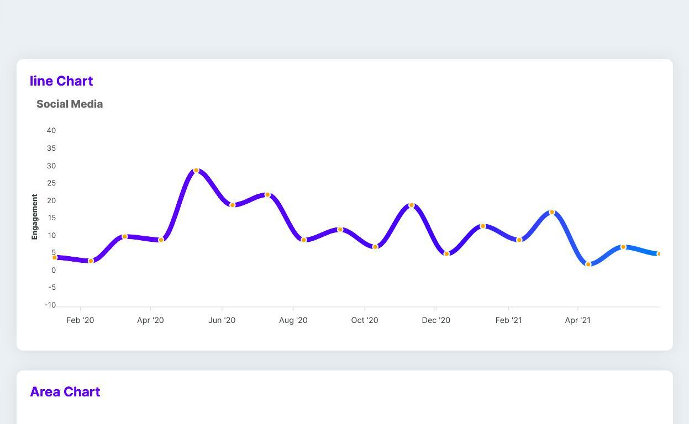
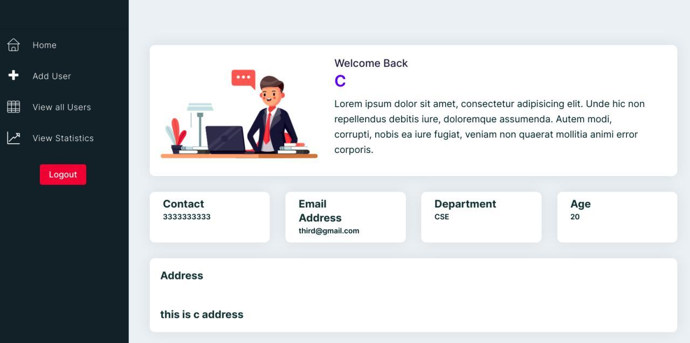

# A Django app - Admin/Users Permissions and Roles Management

---

### Installation

---
- Clone the repository.
  
`git clone https://github.com/undefinedzack/Django-User-Roles-and-Permissions.git`
- We'll create and activate a virtual environment. 

`python3 -m venv env`

`source env/bin/activate`

- Installing our app requirements

`cd root`

`pip3 install -r requirements.txt`

- We're ready to initiate server.

`python3 manage.py runserver`

- It's on!

## Results

---

